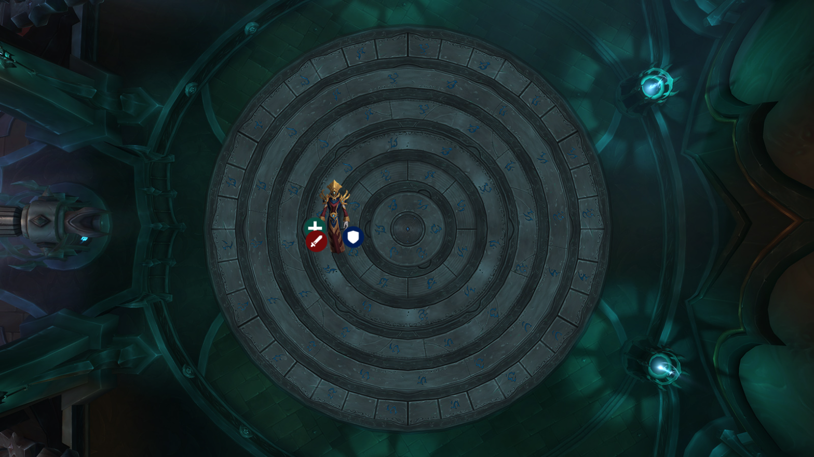
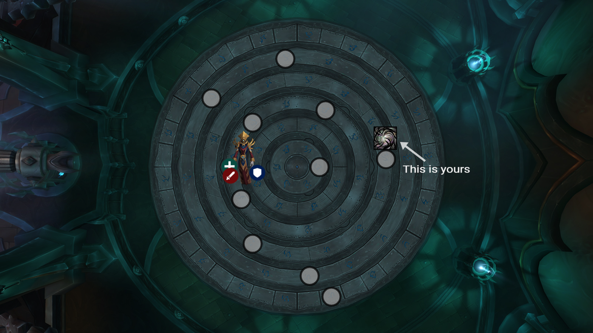
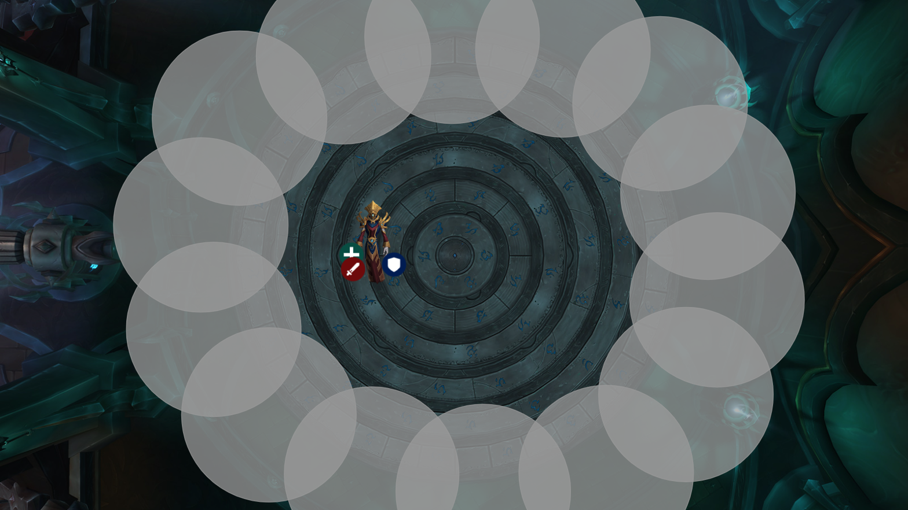
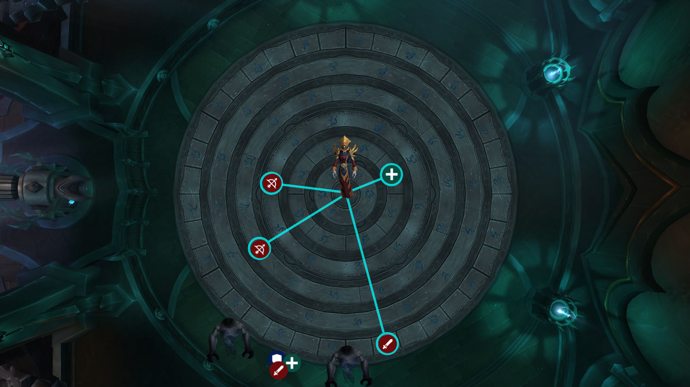
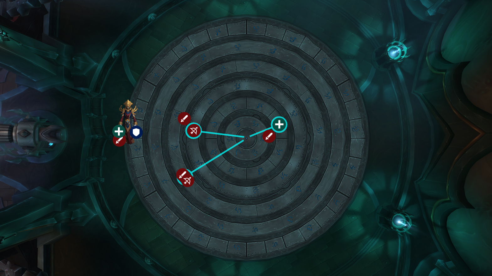

# Weakauras

(Should already have these)
- Runic Affinity ExRT List : https://wago.io/2JThfnb9V
- Runic Affinity Personal Notifier: https://wago.io/B-O91VtCg

(New and very helpful)
- Improved Runic Affinity Notifier: https://wago.io/jaGdba8A9

# Overview

The key theme on this fight is going to be most of the wipes coming from people not acting immediately.  The boss overall is pretty easy and will fall over if, as soon as a mechanic starts, everyone stops what they're doing and executes their job.

# Phase 1 & 2

This phase is very similar to heroic with a few mythic additions to it.  It's preferred to position the boss closer towards the middle so people are able to run to any area they need to in a speedy manner.  You can get up to three sets of beams now instead of the 1 you get in heroic, but there's no new variation of how the beams come out.

## Base Setup

- Boss is tanked towards the center
- Move immediately for any mechanic you get
- Dodge up to 3 sets of consecutive beams instead of 1 now
- Kill adds near boss for cleave

## Grim Portent

- 10 gray circles go out around runes
- Run to and stand in the circle with the giant Malevolence orb (Ner'zhul dispel indicator) over it

## Call of Eternity

- Stop casting and move to the outside area
- Four fate fragments (slow moving orbs from intermission) spawn from each location
- Movement immunities can remove them if the area needs clearing

# Intermissions

This phase isn't very different if everyone stops what they're doing and immediately goes to your assigned rune.  The mythic mechanic here is a new laser beam that travels from the center to all the runes that are in motion, dealing a huge amount of damage (as a DoT) to anyone that traverses it.  Since all the runes move at the same relational speed, this isn't really an issue until P3 if everyone travels clockwise.

## Base Setup

- Start with everyone along the outside
- Actual position tanking the adds doesn't matter
- Immediately go to your designated rune as soon as they spawn
- Heal or movement immunity for anyone that can't dodge fate fragments

# Phase 3

Really the only hard part of the fight as it's the only time you might need to cross beams while moving runes.  Short blinks and movements get over beams without taking damage, DH can double jump them, some people will just have to pop defensives and get healed.  Only have 30 seconds to run the runes so there can't be hesitation.  Three runes will be lit up during this phase, each rune should have two people sent to it to make sure they all have coverage.  Always take the shortest distance, and anyone no longer needed can go back to DPSing.  If you don't go the shortest direction, it's a wipe.  If you take too long to coordinate which direction it should go, it's a wipe.  It's better to have a little lower DPS and have to do a second one than to try to get a few extra casts off and cause a wipe.

---