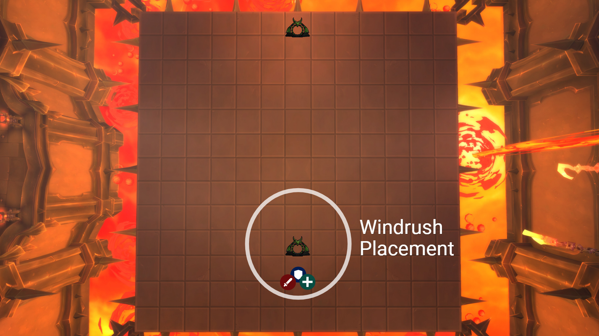
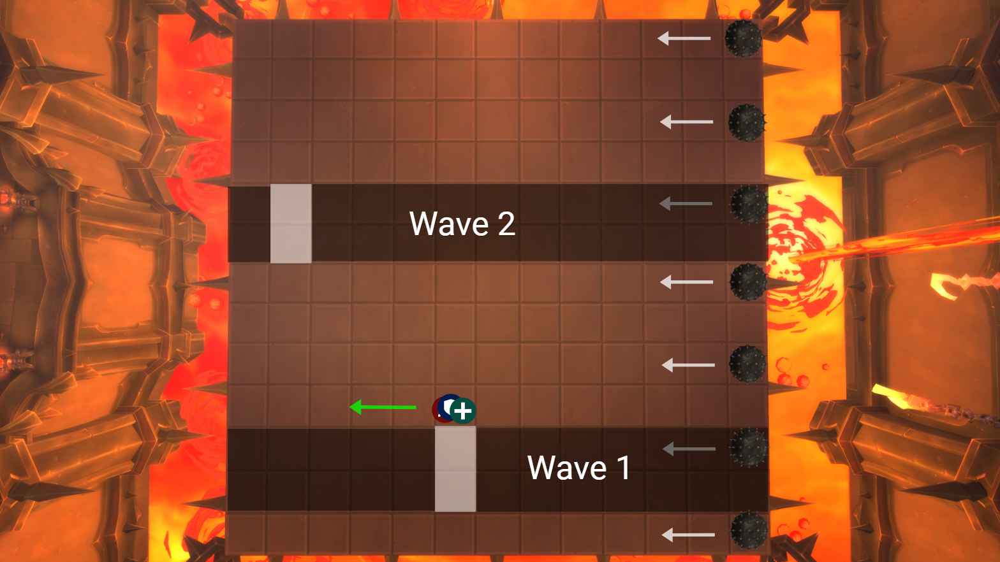
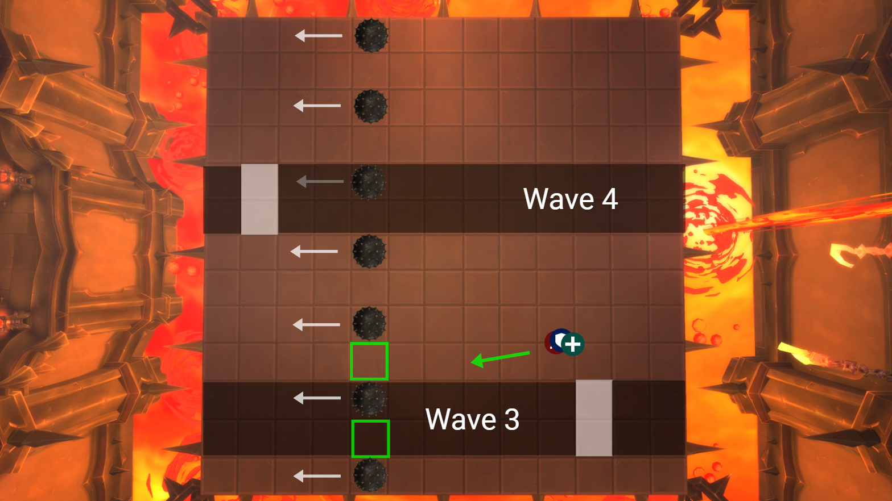
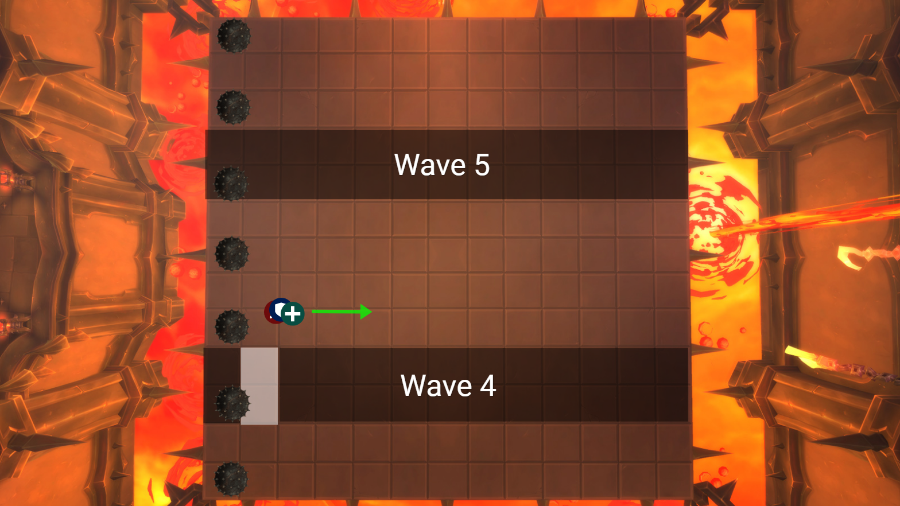
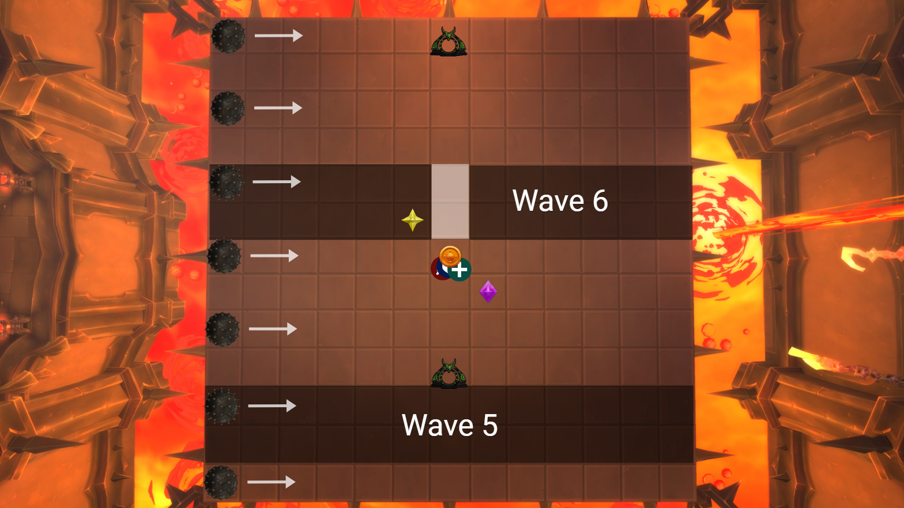
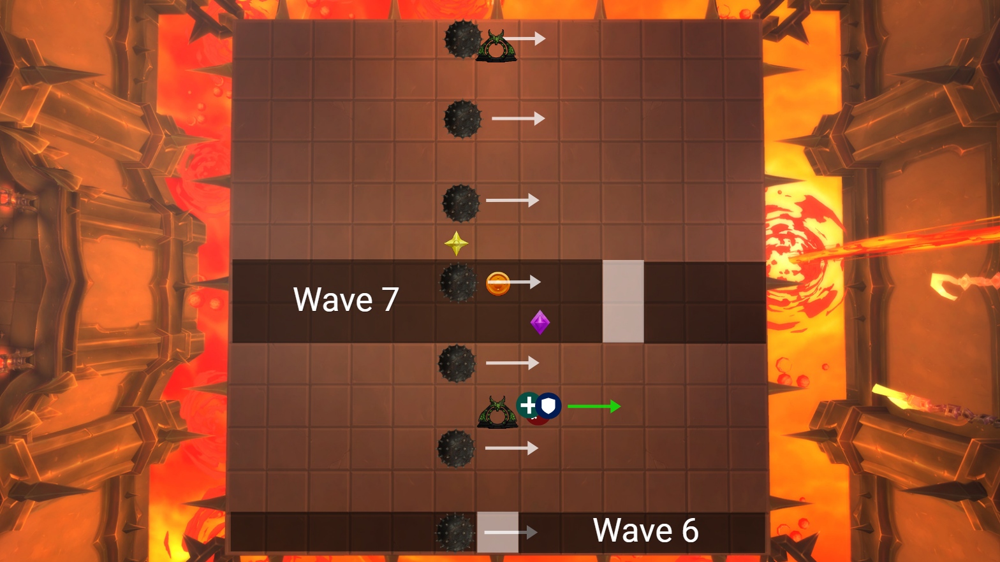
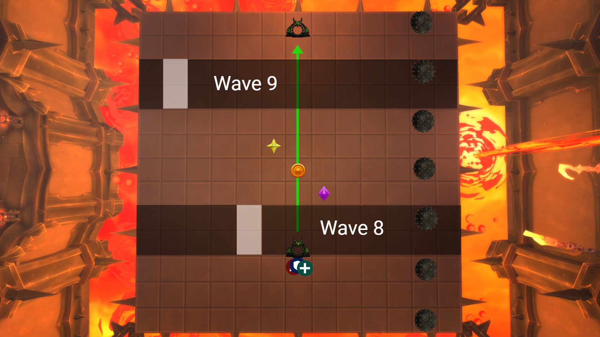

# Phase 1

This phase is a lot of rinse and repeat where we get to learn the basic movements that occur throughout the encounter.  We want to push out of this phase at about the 2 minute mark.  If we approach 70% before the 2 minute mark we're going to stop DPS.  There will be a set of balls at ~1:45 and an Axe throw at ~2:00.

## Base Setup

- Boss is tanked at bottom left corner
- Axe is taken to top right corner
- This creates a 5x5 safe zone for the raid to stand in
- Reset to this position after mechanics are over

## Chains

- Chains go to your designated marker in the center
- You can move directly to them in P1

## Spikes From Axe

- Spikes come out in all directions in a 3x3 from the target of Axe
- Spikes also come out in all directions in a 1x1 from all players with chains

## Spiked Balls

### Targeting

- Spawn directions are still random like on the other difficulties
- We're going to kill the spiked ball that spawns in the nearest corner to the raid

### Movement

- Chains should only move in straight lines perpendicular to the spiked balls until the raid has passed through safely
- If chained players have a blink, they should use it to get across (still staying in their perpendicular lane)
- The rest of the raid will run up to the nearest spiked ball along the edge and kill it
- Melee be careful to stay at max melee range and walk backwards as you're killing the spiked ball

## Traps

- Traps are placed behind the raid along the edge
- Do. Not. Touch. Traps.  The RL will handle them, either by doing them or by calling out someone by name to break them one by one

---

# Intermission

The good news about this phase on Mythic is that it's highly scripted with few variable pieces to it. There's still nine waves of spikes (same as always).  There's two sets of spike balls that spawn on every other tile from either right to left or left to right.  There's also the usual fire that rains down on random players' positions.  At the end of the intermission, adds will spawn from the last set of fire that comes down.  We're going to use a warlock gate to both gather all of those pools of fire (and thus the adds) and to ignore the final two waves of spikes.  We'll use a combination of windrush totem and roar to move from side to side, staying on the bottom half of the platform.

## Base Setup

- Start with everyone in the bottom center.
- Windrush totems should try to cover the bottom center area of the platform.
- Warlock gate placed around the start of the 4th tile from the bottom center edge.
- Stay in the bottom half

## Waves 1 and 2

- The hole will be in one of the middle columns of Wave 1.
- Spike balls will spawn on the right side of the platform while Wave 2 is approaching.
- The hole for Wave 2 will either be one of the right-most columns or left-most columns.

## Waves 3 and 4

- The hole for Waves 3 and 4 alternate side to side continuing from where the hole on Wave 2 was.
- When running between the spike balls, always move down to have plenty of room from the next Wave.

## Wave 5

- Wave 5 has no holes on it, but there's multiple ways to get across it.
- Any type of instant long distance movement (NF Soulshape, Door of Shadows, Warlock teleport, Voidelf racial, Shadowstep, Transcendence, Leap)
- Priest grip works to get people across it.
- Any physical immunity or big DR/Absorb with a stun immunity (Turtle, BoP, Fleshcraft channel, IBF+External)
- You can jump off the right side of the platform to get around it with DH glide, disengage, wild charge.

## Wave 6

- The second set of spike balls will spawn on the left side after Wave 5.
- The hole for Wave 6 will always be the center column.
- Try to group up on Circle after Wave 5 so that you don't spawn fire on the gateway.
- After fire circles appear, move down and stack on the gateway.

## Wave 7

- The hole on Wave 7 will be either on the left or the right side.
- We will move to whichever side the hole of Wave 7 is on while staying in the row the gateway is on.
- We have to move as closely as a group as we can to not spread fire on each other.
- After Wave 7, move as a group back to the center stack behind the gateway waiting for Wave 8.

## Waves 8-9 and stacking for adds

- As soon as Wave 8 is about to hit the row above the gateway, everyone will take it.
- Stay stacked as soon as you land until the last set of fire circles goes out.
- Have all CDs ready, the adds need to die asap.

---