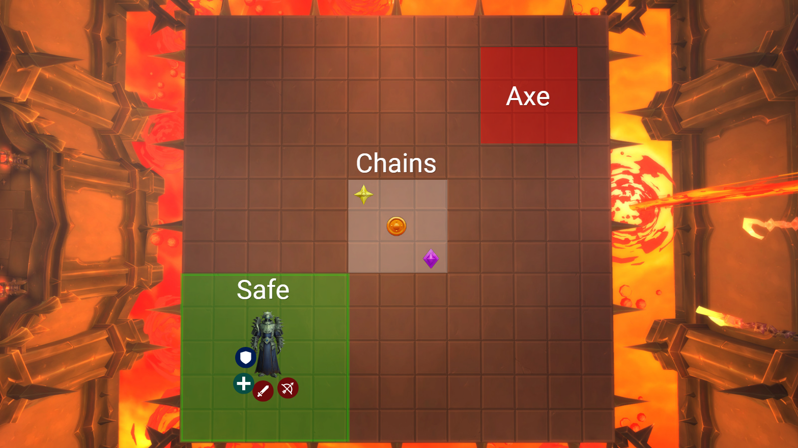
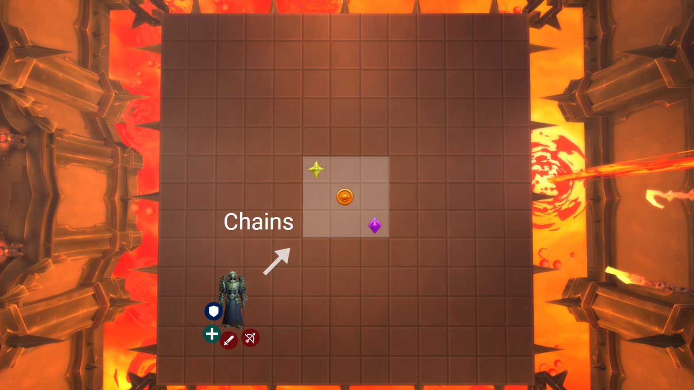
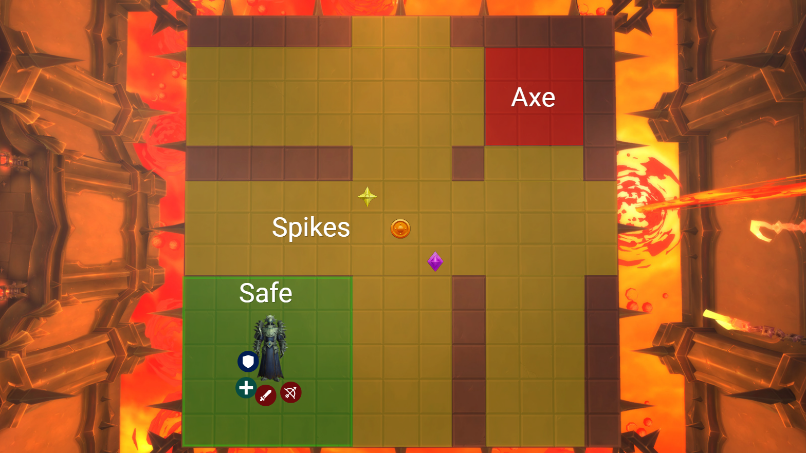
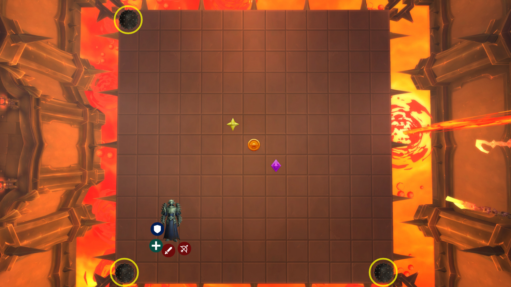
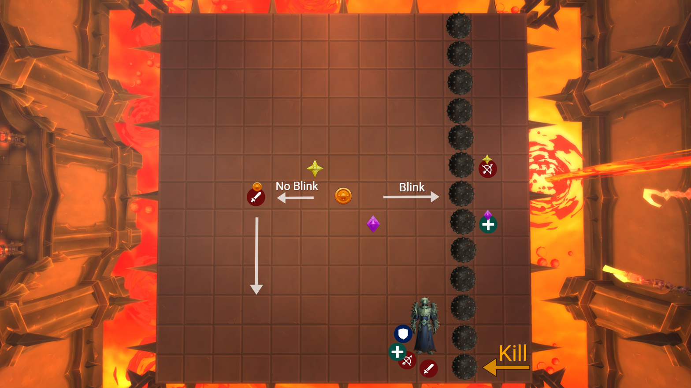
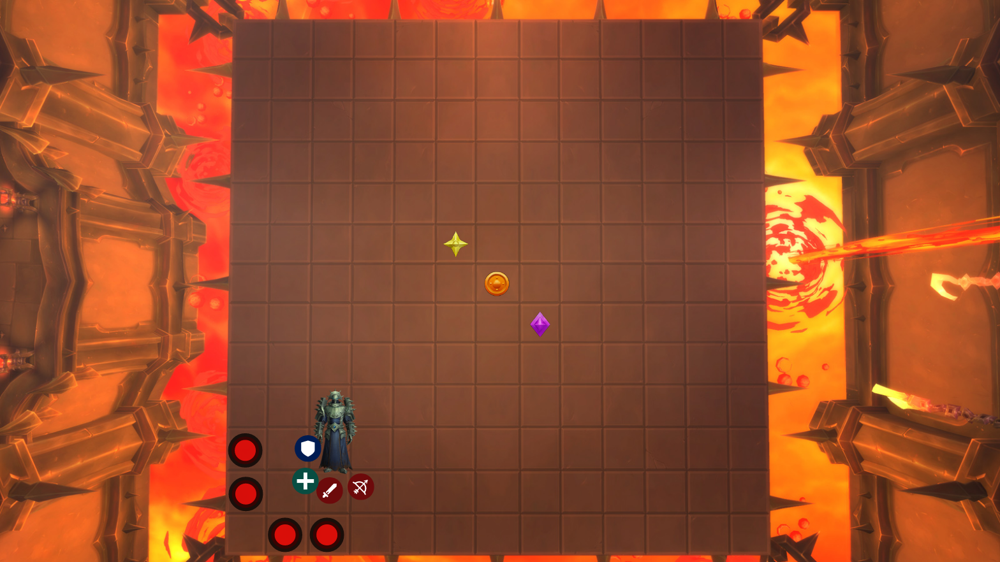

# Phase 1

This phase is a lot of rinse and repeat where we get to learn the basic movements that occur throughout the encounter.  We want to push out of this phase at about the 2 minute mark.  If we approach 70% before the 2 minute mark we're going to stop DPS.  There will be a set of balls at ~1:45 and an Axe throw at ~2:00.

## Base Setup

- Boss is tanked at bottom left corner
- Axe is taken to top right corner
- This creates a 5x5 safe zone for the raid to stand in
- Reset to this position after mechanics are over

## Chains

- Chains go to your designated marker in the center
- You can move directly to them in P1

## Spikes From Axe

- Spikes come out in all directions in a 3x3 from the target of Axe
- Spikes also come out in all directions in a 1x1 from all players with chains

## Spiked Balls

### Targeting

- Spawn directions are still random like on the other difficulties
- We're going to kill the spiked ball that spawns in the nearest corner to the raid

### Movement

- Chains should only move in straight lines perpendicular to the spiked balls until the raid has passed through safely
- If chained players have a blink, they should use it to get across (still staying in their perpendicular lane)
- The rest of the raid will run up to the nearest spiked ball along the edge and kill it
- Melee be careful to stay at max melee range and walk backwards as you're killing the spiked ball

## Traps

- Traps are placed behind the raid along the edge
- Do. Not. Touch. Traps.  The RL will handle them, either by doing them or by calling out someone by name to break them one by one
